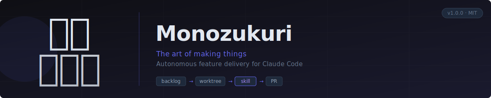
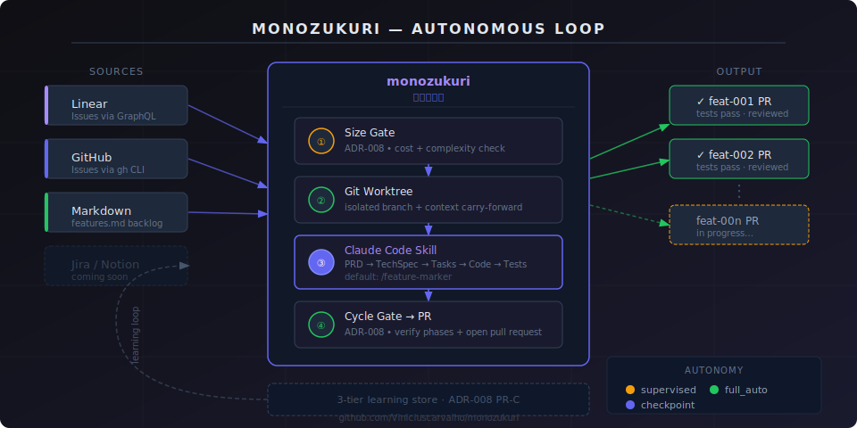

<p align="center">
  
</p>

<p align="center">
  <strong>ものづくり — reads your backlog, creates worktrees, invokes a Claude Code skill for each feature, and opens PRs. While you're away.</strong>
</p>

<p align="center">
  <a href="https://www.npmjs.com/package/@viniciuscarvalho/monozukuri">
    
  </a>
  <a href="https://github.com/Viniciuscarvalho/homebrew-tap">
    
  </a>
  <a href="https://github.com/Viniciuscarvalho/monozukuri/blob/main/LICENSE">
    
  </a>
  <a href="https://github.com/Viniciuscarvalho/monozukuri">
    
  </a>
  <a href="https://github.com/sponsors/Viniciuscarvalho">
    
  </a>
</p>

<p align="center">
  <code>autonomous backlog</code> · <code>git worktrees</code> · <code>skill-agnostic</code> · <code>3-tier learning</code> · <code>Linear · GitHub · Markdown</code>
</p>

---

## Quick start

```bash
brew tap viniciuscarvalho/tap
brew install monozukuri

cd your-project
monozukuri init
monozukuri run --dry-run    # preview the plan
monozukuri run              # execute
```

---

## How it works

<p align="center">
  
</p>

```mermaid
flowchart LR
  B[Backlog] -->|size gate| W[Git Worktree]
  W -->|invoke skill| S[/feature-marker\nPRD → Tests]
  S -->|cycle gate| PR[Pull Request]
  PR -->|learning store| B
```

For each feature in the backlog, Monozukuri:

```
1. Reads + sorts backlog from your source (Linear, GitHub Issues, or features.md)
2. Runs the size gate — skips features that are too large or too risky
3. Creates an isolated git worktree with context from completed features
4. Calls your Claude Code skill (default: /feature-marker)
     └─ PRD → Tech Spec → Tasks → Code → Tests → PR
5. Runs the cycle gate — verifies all phases completed and PR exists
6. Writes learnings to the 3-tier store (feature / project / global)
7. Moves to the next feature
```

---

## The name

**Monozukuri** (ものづくり) is a Japanese concept meaning "the art and science of making things."
It embodies continuous improvement, craftsmanship, and the relentless pursuit of quality in creation — the same principles that should govern autonomous software delivery.

---

## Works with any Claude Code skill

Monozukuri is skill-agnostic. It defaults to [Feature-marker](https://github.com/Viniciuscarvalho/Feature-marker) but works with any Claude Code skill that handles feature implementation.

Configure which skill to invoke in `.monozukuri/config.yaml`:

```yaml
skill:
  command: feature-marker # any Claude Code slash-command
```

Popular options:

- [Feature-marker](https://github.com/Viniciuscarvalho/Feature-marker) — PRD → TechSpec → Tasks → Code → Tests → PR
- Your own custom skill
- No skill — just a well-written `CLAUDE.md` in your project

---

## Installation

### Homebrew (recommended)

```bash
brew tap viniciuscarvalho/tap
brew install monozukuri
```

### NPX

```bash
npx @viniciuscarvalho/monozukuri run --dry-run
```

### From source

```bash
git clone https://github.com/Viniciuscarvalho/monozukuri.git
cd monozukuri
./scripts/orchestrate.sh --help
```

Requires: `node >=18`, `jq`, `gh` (for PR creation), and the Claude Code CLI (`claude`).

---

## CLI reference

```bash
monozukuri init                           # scaffold .monozukuri/config.yaml in your project
monozukuri run                            # execute the backlog loop
monozukuri run --dry-run                  # preview the plan without executing
monozukuri run --autonomy full_auto       # fully autonomous (bypass permissions)
monozukuri run --feature feat-001         # run a single feature by ID
monozukuri run --resume                   # skip already-completed features
monozukuri status                         # show current loop state
monozukuri cleanup                        # remove worktrees and reset state
monozukuri learning list                  # show captured learnings
monozukuri calibrate                      # calibrate token cost estimates
```

---

## Autonomy levels

| Level        | Behaviour                                                      |
| ------------ | -------------------------------------------------------------- |
| `supervised` | Pauses after each phase for your approval                      |
| `checkpoint` | Full pipeline, creates PR, waits for merge before next feature |
| `full_auto`  | Full pipeline + `bypassPermissions` + proceeds immediately     |

---

## Configuration

After `monozukuri init`, edit `.monozukuri/config.yaml`:

```yaml
# Which Claude Code skill to invoke for each feature
skill:
  command: feature-marker

source:
  adapter: markdown # linear | github | markdown
  markdown:
    file: features.md

autonomy: checkpoint # supervised | checkpoint | full_auto

model:
  default: opusplan # opus | sonnet | haiku | opusplan
```

See `templates/config.yaml` in this repo for the full reference with all options documented.

---

## Architecture decisions

| ADR                                                | Decision                                                              |
| -------------------------------------------------- | --------------------------------------------------------------------- |
| [ADR-008](docs/adr/008-orchestrator-economy.md)    | Token economy: cost gates, routing, 3-tier learning, size/cycle gates |
| [ADR-009](docs/adr/009-local-models.md)            | Local model integration (Ollama embedding / classifier / summarizer)  |
| [ADR-010](docs/adr/010-stuck-state-elimination.md) | Stuck-state elimination: subshell fix, timeouts, PID tracking         |
| [ADR-011](docs/adr/011-security-hardening.md)      | Security: prompt sanitization, permission guardrails, stack detection |

---

## Backlog adapters

| Adapter    | Source                          | Auth                       |
| ---------- | ------------------------------- | -------------------------- |
| `markdown` | `features.md` in your project   | None                       |
| `github`   | GitHub Issues filtered by label | `gh auth login`            |
| `linear`   | Linear issues filtered by team  | `LINEAR_API_KEY` in `.env` |

---

## Relationship to Feature-marker

Monozukuri and Feature-marker are **separate, independently installable tools** that work together:

|               | Feature-marker                         | Monozukuri                        |
| ------------- | -------------------------------------- | --------------------------------- |
| **What**      | Claude Code skill for one feature      | Terminal loop for a whole backlog |
| **Where**     | Inside Claude Code (`/feature-marker`) | Your terminal (`monozukuri run`)  |
| **Installs**  | `brew install feature-marker`          | `brew install monozukuri`         |
| **State dir** | `.claude/feature-state/`               | `.monozukuri/`                    |

The only connection is the `skill.command` config value in `.monozukuri/config.yaml`.

---

## License

MIT © [Vinicius Carvalho](https://github.com/Viniciuscarvalho)

---

<p align="center">
  Built with 🤖 for the AI-assisted development community
</p>
