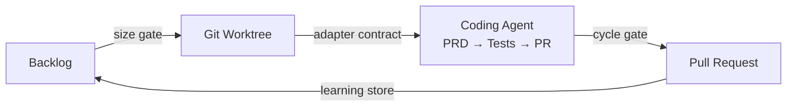

<p align="center">
  
</p>

<p align="center">
  <strong>ものづくり — reads your backlog, creates worktrees, runs your coding agent of choice for each feature, and opens PRs. While you're away.</strong>
</p>

<p align="center">
  <a href="https://github.com/Viniciuscarvalho/monozukuri/actions/workflows/ci.yml">
    
  </a>
  <a href="https://www.npmjs.com/package/@viniciuscarvalho/monozukuri">
    
  </a>
  <a href="https://github.com/Viniciuscarvalho/homebrew-tap">
    
  </a>
  <a href="https://github.com/Viniciuscarvalho/monozukuri/releases">
    
  </a>
  <a href="https://github.com/Viniciuscarvalho/monozukuri/blob/main/LICENSE">
    
  </a>
  <a href="https://github.com/Viniciuscarvalho/monozukuri">
    
  </a>
  <a href="https://github.com/sponsors/Viniciuscarvalho">
    
  </a>
  <a href="docs/canary-history.md">
    
  </a>
</p>

<p align="center">
  <code>autonomous backlog</code> · <code>git worktrees</code> · <code>agent-agnostic</code> · <code>3-tier learning</code> · <code>workflow memory</code> · <code>Linear · GitHub · Markdown</code>
</p>

---

## Quick start

```bash
# First install
brew tap viniciuscarvalho/tap
brew install monozukuri

# Upgrade later
brew update && brew upgrade monozukuri
```

```bash
cd your-project
monozukuri doctor       # verify all dependencies are present and authenticated
monozukuri init
monozukuri run --dry-run    # preview the plan
monozukuri run              # execute
```

> **Requires:** `node >= 18`, `jq`, `gh` (for PR creation), and a supported coding-agent CLI (`claude`, `codex`, `gemini`, or `kiro`).  
> Run `monozukuri doctor` after install — it checks every dependency and surfaces missing auth in one pass.

---

## Choose your agent

Monozukuri drives any major coding-agent CLI through a single adapter contract. Pick the one you already have installed:

```yaml
# .monozukuri/config.yaml
agent: claude-code # default — needs the `claude` CLI
# agent: codex       # OpenAI Codex CLI  (needs OPENAI_API_KEY)
# agent: gemini      # Google Gemini CLI (needs GEMINI_API_KEY or gcloud ADC)
# agent: kiro        # AWS Kiro          (needs AWS credentials)
```

Switch at any time with `monozukuri agent enable <name>`, or detect what's available with `monozukuri agent list`.

---

## Highlights

- **One command, whole backlog.** `monozukuri run` walks every feature in your source — Linear, GitHub Issues, or a plain `features.md` — without further input.
- **Agent-agnostic.** Drives Claude Code, Codex, Gemini, or Kiro through a single adapter contract. Switch agents with one config line — no other changes required.
- **Isolated git worktrees per feature.** No branch juggling, no dirty working directory, no cross-contamination between runs.
- **Three autonomy levels.** From `supervised` (pause after each phase) to `full_auto` (fully unattended overnight runs).
- **Cost-aware size & cycle gates.** Skips features that are too large, verifies every phase completed, enforces token budgets.
- **3-tier learning store.** Every completed feature writes learnings at feature / project / global scope — the next run starts smarter.
- **Skills.** Installable `mz-*` skills give each pipeline phase a dedicated agent persona with its own prompt, validation rules, and reference materials. Install once with `monozukuri setup`; the adapter picks them up automatically.
- **Workflow memory.** Per-feature `MEMORY.md` and `task_NN.md` files let the agent carry decisions, learnings, and handoffs across tasks within a single feature run — without polluting the global learning store.
- **Multiple backlog adapters.** `markdown`, `github`, `linear` — pick where your backlog already lives.
- **Local-first, zero vendor lock-in.** Runs on your machine, writes plain files, uses your own agent CLI credentials.

---

## How it works

<p align="center">
  
</p>



For each feature in the backlog, Monozukuri:

```
1. Reads + sorts backlog from your source (Linear, GitHub Issues, or features.md)
2. Runs the size gate — skips features that are too large or too risky
3. Creates an isolated git worktree with context from completed features
4. Bootstraps workflow memory (MEMORY.md + task_NN.md) for cross-task context
5. Invokes your coding agent through 3-tier routing:
     Tier 1 — native skill  (mz-create-prd, mz-execute-task, …)  if installed
     Tier 2 — rendered prompt  when CONTEXT_JSON is available (all 6 phases)
     Tier 3 — legacy feature-marker  (always available, no setup required)
     └─ PRD → Tech Spec → Tasks → Code → Tests → PR
6. Runs the cycle gate — verifies all phases completed and PR exists
7. Writes learnings to the 3-tier store (feature / project / global)
8. Moves to the next feature → repeat until backlog is clean
```

---

## Installation

### Homebrew (recommended)

```bash
brew tap viniciuscarvalho/tap
brew install monozukuri

# Upgrade later
brew update && brew upgrade monozukuri
```

### NPM (global)

```bash
npm install -g @viniciuscarvalho/monozukuri

# Upgrade later
npm update -g @viniciuscarvalho/monozukuri
```

### NPX (no install)

```bash
npx @viniciuscarvalho/monozukuri run --dry-run
```

### From source

```bash
git clone https://github.com/Viniciuscarvalho/monozukuri.git
cd monozukuri
./scripts/orchestrate.sh --help
```

After any install method, run `monozukuri doctor` to confirm every dependency is available and authenticated.

---

## CLI reference

```bash
monozukuri init                           # scaffold .monozukuri/config.yaml in your project
monozukuri run                            # execute the backlog loop
monozukuri run --dry-run                  # preview the plan without executing
monozukuri run --autonomy full_auto       # fully autonomous (bypass permissions)
monozukuri run --feature feat-001         # run a single feature by ID
monozukuri run --resume                   # skip already-completed features
monozukuri status                         # show current loop state
monozukuri cleanup                        # remove worktrees and reset state
monozukuri learning list                  # show captured learnings
monozukuri calibrate                      # calibrate token cost estimates
monozukuri doctor                         # verify dependencies, auth, and environment
monozukuri agent list                     # list available agents and install status
monozukuri agent enable <name>            # set active agent in config (claude-code | codex | gemini | kiro)
monozukuri agent doctor [name]            # check install and auth for all or one agent
```

### `monozukuri setup`

Install `mz-*` skills for any supported coding agent:

```bash
monozukuri setup install --agent claude-code   # installs to ~/.claude/skills/
monozukuri setup install --agent cursor        # installs to .agents/skills/ in your project
monozukuri setup status                        # shows installed skills per agent
monozukuri setup list                          # lists available skills
monozukuri setup uninstall mz-create-prd       # remove a single skill
monozukuri setup --dry-run                     # preview without writing
```

Skills are not required — the pipeline falls back to Tier 2 (rendered prompt) or Tier 3 (feature-marker) automatically. Install them for a more focused agent persona with built-in validation rules.

| Flag        | Default | Description                                                  |
| ----------- | ------- | ------------------------------------------------------------ |
| `--agent`   | _auto_  | Target agent: `claude-code`, `cursor`, `gemini-cli`, `codex` |
| `--dry-run` | `false` | Preview without writing                                      |
| `--yes`     | `false` | Skip confirmation                                            |

---

### `monozukuri init`

| Flag       | Default    | Description                                     |
| ---------- | ---------- | ----------------------------------------------- |
| `--force`  | `false`    | Overwrite existing config                       |
| `--source` | `markdown` | Backlog adapter: `markdown`, `github`, `linear` |

### `monozukuri run`

| Flag         | Default         | Description                                                          |
| ------------ | --------------- | -------------------------------------------------------------------- |
| `--dry-run`  | `false`         | Preview the plan without executing                                   |
| `--autonomy` | _(from config)_ | `supervised`, `checkpoint`, `full_auto`                              |
| `--feature`  |                 | Run a single feature by ID                                           |
| `--resume`   | `false`         | Skip already-completed features                                      |
| `--model`    | _(from config)_ | Override model: `opus`, `sonnet`, `haiku`, `opusplan`                |
| `--agent`    | _(from config)_ | Override agent: `claude-code`, `codex`, `gemini`, `kiro`             |
| `--no-ui`    | `false`         | Disable the Ink TUI; fall back to plain terminal output              |
| `--skill`    | _(deprecated)_  | Deprecated — use `--agent` and `agents.claude-code.skills` in config |

### TUI (terminal UI)

The Ink TUI activates automatically when running `monozukuri run` or `monozukuri setup` in an interactive terminal (TTY). It shows live feature cards, phase progress, cost meter, and log pane — consuming the JSONL event stream emitted by the orchestrator.

```bash
monozukuri run             # TUI on by default in a TTY terminal
monozukuri run --no-ui    # disable TUI, use plain terminal output
```

In non-TTY environments (CI, pipes, `--json`, `--dry-run`) the TUI is skipped automatically and the orchestrator emits a clean JSONL event stream instead.

### `monozukuri status`

| Flag     | Default | Description                        |
| -------- | ------- | ---------------------------------- |
| `--json` | `false` | Machine-readable output for piping |

### `monozukuri learning list`

| Flag      | Default | Description                              |
| --------- | ------- | ---------------------------------------- |
| `--tier`  | `all`   | `feature`, `project`, `global`, or `all` |
| `--limit` | `20`    | Maximum entries to show                  |

### `monozukuri cleanup`

| Flag    | Default | Description              |
| ------- | ------- | ------------------------ |
| `--yes` | `false` | Skip confirmation prompt |

### `monozukuri calibrate`

Analyzes the last N completed features, computes actual-vs-estimated token ratios per phase, and writes updated calibration coefficients to `config/pricing.yaml`. Requires 5+ completed features with `actual_tokens` recorded.

| Flag         | Default | Description                          |
| ------------ | ------- | ------------------------------------ |
| `--sample N` | `20`    | Number of recent features to analyze |

Example output:

```
Calibration Report (last 20 features):
═══════════════════════════════════════════════════════════════

Agent: claude-code / Model: claude-sonnet-4-6

Phase      Est tokens   Act tokens   Ratio   Guidance
─────────────────────────────────────────────────────────
prd            25,000       18,432    0.74    ↓ reduce baseline
code           12,000       15,891    1.32    ↑ raise baseline
tests           8,000        7,821    0.98    ✓ baseline accurate
...

→ Updated calibration coefficients written to config/pricing.yaml
```

---

## Autonomy levels

| Level        | Behaviour                                                      |
| ------------ | -------------------------------------------------------------- |
| `supervised` | Pauses after each phase for your approval                      |
| `checkpoint` | Full pipeline, creates PR, waits for merge before next feature |
| `full_auto`  | Full pipeline + `bypassPermissions` + proceeds immediately     |

Set once in `.monozukuri/config.yaml` or override per-run with `--autonomy`.

---

## Supported models

Set a default in config or override with `--model`.

| Alias      | Use case                                                          |
| ---------- | ----------------------------------------------------------------- |
| `opus`     | Highest reasoning, highest cost — complex features                |
| `sonnet`   | Balanced default for most features                                |
| `haiku`    | Fast, cheap — small features and calibration runs                 |
| `opusplan` | Opus for planning phases, Sonnet for implementation — recommended |

---

## Backlog adapters

| Adapter    | Source                             | Auth                       |
| ---------- | ---------------------------------- | -------------------------- |
| `markdown` | `features.md` in your project root | None                       |
| `github`   | GitHub Issues filtered by label    | `gh auth login`            |
| `linear`   | Linear issues filtered by team     | `LINEAR_API_KEY` in `.env` |

---

## Configuration

After `monozukuri init`, edit `.monozukuri/config.yaml`:

```yaml
# Active coding agent (claude-code | codex | gemini | kiro)
agent: claude-code

# Per-agent settings (optional)
agents:
  claude-code:
    skills:
      prd: feature-marker # Claude Code skill to use for each phase
      code: feature-marker # omit a phase to use the rendered prompt directly
  codex:
    model: gpt-5
  gemini:
    model: gemini-2.5-pro
  kiro:
    use_native_specs: true # use `kiro spec create` for prd/techspec phases

source:
  adapter: markdown # linear | github | markdown
  markdown:
    file: features.md

autonomy: checkpoint # supervised | checkpoint | full_auto

model:
  default: opusplan # opus | sonnet | haiku | opusplan
```

See [`templates/config.yaml`](./templates/config.yaml) for the full reference with every option documented.

---

## Skills

Skills are installable agent personas that replace the generic feature-marker with phase-specific prompts, validation rules, and reference materials. Each skill lives in `skills/mz-*/` and is invoked natively when detected by the adapter.

### Install

```bash
monozukuri setup install --agent claude-code
```

Skills install to `~/.claude/skills/` (global) or `.claude/skills/` (project-local). Universal agents (Cursor, Codex, Gemini) use `.agents/skills/` instead.

### How routing works

Every phase invocation checks three tiers in order:

| Tier                | Condition                                           | Invocation                                       |
| ------------------- | --------------------------------------------------- | ------------------------------------------------ |
| 1 — Native skill    | `mz-<phase>` skill installed in project or globally | `claude --agent mz-create-prd -p <feat-id>`      |
| 2 — Rendered prompt | `CONTEXT_JSON` available, no skill installed        | Rendered phase template piped to `claude -p`     |
| 3 — Legacy          | No skill, no context                                | `claude --agent feature-marker -p prd-<feat-id>` |

Skills are not required. The pipeline works on any machine with just the agent CLI.

### Available skills

| Skill                  | Phase         | Description                                                              |
| ---------------------- | ------------- | ------------------------------------------------------------------------ |
| `mz-create-prd`        | `prd`         | Generates a PRD with strict heading and FR-NNN validation                |
| `mz-create-techspec`   | `techspec`    | Generates a TechSpec with decisions table and files_likely_touched list  |
| `mz-create-tasks`      | `tasks`       | Generates task breakdown validated against `schemas/tasks.schema.json`   |
| `mz-execute-task`      | `code`        | Executes one task end-to-end inside the worktree                         |
| `mz-run-tests`         | `tests`       | Runs the test suite and writes per-task acceptance criteria              |
| `mz-open-pr`           | `pr`          | Opens a GitHub PR with a structured body                                 |
| `mz-workflow-memory`   | _(all)_       | Maintains `MEMORY.md` and `task_NN.md` across tasks within a feature run |
| `mz-validate-artifact` | _(validator)_ | Validates a generated artifact against its skill's validation rules      |

### Workflow memory

Before each feature invocation the orchestrator bootstraps two files:

- **`MEMORY.md`** — shared across all tasks of the feature run (cap: 150 lines / 12 KiB)
- **`task_NN.md`** — specific to the current invocation (cap: 200 lines / 16 KiB)

Both live at `.monozukuri/runs/<feature-id>/memory/`. When a file exceeds its cap the orchestrator sets `MONOZUKURI_NEEDS_COMPACTION` (`workflow`, `task`, or `both`) in the environment before calling the agent. The `mz-workflow-memory` skill reads that variable and compacts the relevant file before continuing.

This is separate from the 3-tier learning store (`~/.claude/monozukuri/learned/`), which persists knowledge across features and projects.

---

## Project layout

```
orchestrate.sh             Entry point (dev); Homebrew/NPX wrappers exec this
cmd/                       Subcommand handlers (init, run, status, agent, setup, …)
lib/                       Library modules
  agent/                   Adapter contract + per-agent adapters (claude-code, codex, gemini, kiro)
    skill-detect.sh        Phase→skill mapping and install detection (Tier 1 routing)
  config/                  Config loader and schema
  core/                    Utilities, router, cost, worktree
  cli/                     Output helpers and JSONL emitter
  prompt/phases/           Per-phase prompt templates (prd, techspec, tasks, code, tests, pr)
  run/                     Pipeline, cycle gate, ingest, local-model
  memory/                  3-tier learning store + workflow memory harness
  setup/                   Skill installer helpers (detect, install, verify)
skills/                    Installable mz-* skills
  mz-create-prd/           PRD generation skill
  mz-create-techspec/      TechSpec generation skill
  mz-create-tasks/         Task breakdown skill
  mz-execute-task/         Code execution skill
  mz-run-tests/            Test execution skill
  mz-open-pr/              PR creation skill
  mz-workflow-memory/      Cross-task workflow memory skill
  mz-validate-artifact/    Artifact validation skill
ui/                        Ink TUI — consumes JSONL event stream from orchestrator
templates/                 Config templates copied by `monozukuri init`
test/
  unit/                    Bats unit tests (lib/agent/*, cmd/*, lib/memory/*)
  integration/             Bats integration tests (dry-run, back-compat, setup)
  conformance/             Agent conformance suite + UI display tests
  fixtures/                Mock agent binaries and sample project
bin/                       CLI entry points (Node shim + shell dispatcher)
homebrew/                  Homebrew formula source
npm/                       npm package metadata and shim
assets/                    Banner, architecture diagram
docs/adr/                  Architecture Decision Records
```

---

## Architecture decisions

| ADR                                                | Decision                                                              |
| -------------------------------------------------- | --------------------------------------------------------------------- |
| [ADR-008](docs/adr/008-orchestrator-economy.md)    | Token economy: cost gates, routing, 3-tier learning, size/cycle gates |
| [ADR-009](docs/adr/009-local-models.md)            | Local model integration (Ollama embedding / classifier / summarizer)  |
| [ADR-010](docs/adr/010-stuck-state-elimination.md) | Stuck-state elimination: subshell fix, timeouts, PID tracking         |
| [ADR-011](docs/adr/011-security-hardening.md)      | Security: prompt sanitization, permission guardrails, stack detection |

---

## Development

```bash
make verify    # full pipeline: lint → format-check → test
make lint      # shellcheck on every script
make fmt       # shfmt -w on every script
make test      # bats integration tests
make release   # tag + publish to npm + bump Homebrew formula
```

### Working on the TUI

The terminal UI lives in `ui/` and is built with [Ink](https://github.com/vadimdemedes/ink) — a React renderer for the terminal. The source is TypeScript (`ui/src/`) and compiles to `ui/dist/index.js`, which is what `monozukuri run` loads at runtime.

**Components** (`ui/src/components/`):

| File                | Purpose                                                                    |
| ------------------- | -------------------------------------------------------------------------- |
| `FeatureCard.tsx`   | Per-feature status card (phase, status, cost)                              |
| `FeatureList.tsx`   | Scrollable list of all feature cards                                       |
| `PhaseTimeline.tsx` | Horizontal phase progress bar (prd → techspec → tasks → code → tests → pr) |
| `CostMeter.tsx`     | Live token cost display                                                    |
| `LogPane.tsx`       | Scrollable log output from the orchestrator                                |
| `Header.tsx`        | Run summary bar (agent, autonomy, model)                                   |
| `Footer.tsx`        | Keyboard shortcut hints                                                    |
| `SetupPanel.tsx`    | Progress view for `monozukuri setup`                                       |

**Install dependencies** (first time only):

```bash
cd ui
npm install
```

**Watch mode** — rebuilds `dist/index.js` on every save:

```bash
cd ui
npm run dev
```

**One-off build:**

```bash
cd ui
npm run build
```

**See your changes live:** run `npm run dev` in one terminal, then `monozukuri run` in another. The orchestrator pipes its JSONL event stream into the UI process, so every rebuild is picked up on the next run.

**Run UI tests:**

```bash
cd ui
npm test
```

---

## Contributing

1. Fork and clone the repo
2. Run `./orchestrate.sh --help` to confirm your environment
3. Open a draft PR early — we review small, focused changes fastest
4. Follow [Conventional Commits](https://www.conventionalcommits.org/) so release notes stay clean

See [CONTRIBUTING.md](./CONTRIBUTING.md) and the `good first issue` label for a friendly on-ramp.

---

## The name

**Monozukuri** (ものづくり) is a Japanese concept meaning "the art and science of making things." It embodies continuous improvement, craftsmanship, and the relentless pursuit of quality in creation — the same principles that should govern autonomous software delivery.

---

## License

MIT © [Vinicius Carvalho](https://github.com/Viniciuscarvalho)

---

<p align="center">
  Built with 🤖 for the AI-assisted development community
</p>
