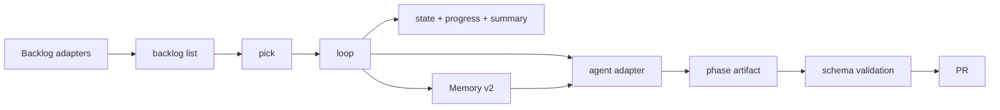

# Monozukuri

Autonomous feature-delivery CLI for solo developers who want ranked selection,
repeatable agent loops, auditable memory, and pull requests instead of one-off
chat sessions.

[](https://github.com/Viniciuscarvalho/monozukuri/releases)
[](https://github.com/Viniciuscarvalho/monozukuri/actions)
[](LICENSE)


## Highlights

- **Ranked backlog selection**: list, filter, score, explain, and pick work from
  markdown, GitHub Issues, Linear, or Jira adapters.
- **Non-interactive pipelines**: `pick --top N`, `pick --json`, and stdin-aware
  `loop` compose cleanly in CI and shell scripts.
- **TUI when you want it**: `monozukuri pick` opens an Ink-based selector with
  vim-style navigation, filtering, preview, and newline ID output.
- **Resumable loop execution**: every loop persists manifests, checkpoints,
  progress events, cost state, and summaries under `.monozukuri/state/`.
- **Hard safety caps**: cost, wall-clock time, per-task tokens, failure modes,
  and circuit breakers are enforced before the next feature starts.
- **Memory v2 provenance**: each learning records source, age, application
  count, agent scope, and traceable prompt usage.
- **Cross-agent adapters**: Claude Code, Codex, and Gemini share the same loop,
  memory, validation, and conformance contracts.
- **Release-grade verification**: Bats suites, mock conformance, MRP token
  assertions, and live canary docs keep expensive checks out of CI by default.

## Quick start

```bash
# Install from source while developing
git clone https://github.com/Viniciuscarvalho/monozukuri.git
cd monozukuri
npm install

# Bootstrap a project that has a backlog
monozukuri init
monozukuri doctor

# See ranked work and run the top three
monozukuri backlog list --limit 10
monozukuri pick --top 3 | monozukuri loop
```

For repo development, use `./orchestrate.sh <subcommand>` from this checkout.
Installed Homebrew and npm entry points both dispatch to the same CLI.

## Pick & Loop

`pick` selects feature IDs. `loop` executes them.

```bash
monozukuri backlog list --format table --limit 50
monozukuri backlog list --label bug,docs --agent codex --format json
monozukuri pick --top 3
monozukuri pick --top 3 --json | jq '.[].id'
monozukuri pick --history
monozukuri pick --replay
monozukuri pick --top 3 --label bug | monozukuri loop --on-failure continue
```

`monozukuri pick` without flags opens the TUI and prints confirmed IDs to
stdout. `q` exits with code `130`; `enter` confirms the current selection. Every
selection is appended to `.monozukuri/state/pick-history.jsonl` and can be
replayed later.

`monozukuri loop` accepts positional IDs or newline IDs from stdin:

```bash
monozukuri loop feat-001 feat-002 feat-003
jq -r '.[].id' selected.json | monozukuri loop --max-cost 10 --max-time 480
monozukuri loop status
monozukuri loop status --follow
monozukuri loop --resume
monozukuri loop --list-runs
```

Each loop feature gets an independent worktree under
`.monozukuri/worktrees/loop-<run_id>/<feature_id>/`. By default, failed features
do not delete their worktrees, so you can inspect them before cleanup.

## How it works

1. **Ingest** reads the configured backlog adapter and normalizes feature cards.
2. **Select** ranks features by priority, age, effort, and dependency status.
3. **Loop** creates one worktree per selected feature and runs the six phases:
   PRD, TechSpec, Tasks, Code, Tests, and PR.
4. **Validate** checks phase artifacts with schema validators and reprompts when
   a fix is possible.
5. **Observe** writes structured progress, cost, checkpoints, summaries, and PR
   results for resume and release gates.


```mermaid
flowchart LR
  A["Backlog adapters"] --> B["backlog list"]
  B --> C["pick"]
  C --> D["loop"]
  D --> E["agent adapter"]
  E --> F["phase artifact"]
  F --> G["schema validation"]
  G --> H["PR"]
  D --> I["state + progress + summary"]
  D --> J["Memory v2"]
  J --> E
```

## Memory v2: Why It's Different

Memory v2 is not a prompt dump. It is a provenance-backed learning store that
answers why a decision exists and when it was last useful.

- The schema is documented in [docs/schemas/memory-v2.md](docs/schemas/memory-v2.md).
- Migration is handled by `monozukuri memory migrate`.
- `monozukuri memory why <lrn-id>` shows source, counters, and recent
  applications.
- `monozukuri memory trace <run-id>` shows summary and escalation decisions.
- Agent-specific learnings are filtered with `agent_specific`.

The sufficiency router is documented in
[ADR-027](docs/adr/027-sufficiency-router.md). It injects a compact summary by
default, preserves omitted IDs as `available_on_request`, and lets Claude Code,
Codex, or Gemini request raw detail with:

```xml
<request-memory id="lrn-xxx"/>
```

That keeps default prompts small while preserving an explicit recovery path when
the summary is not enough.

## Comparison

| Capability | Monozukuri v2 | TaskMaster | Compozy |
| --- | --- | --- | --- |
| Ranked backlog from multiple adapters | Yes | Partial | No |
| Non-interactive pick-to-loop pipeline | Yes | Partial | No |
| Per-feature worktrees and PR creation | Yes | No | Workflow-dependent |
| Cross-agent adapters | Claude Code, Codex, Gemini | Agent-dependent | Primarily workflow runtime |
| Memory provenance with schema validation | Yes | No | Feature-scoped workflow memory |
| On-demand memory escalation | Yes | No | No |
| Cost and token hard caps | Yes | Limited | Runtime-dependent |
| CI-safe mock conformance | Yes | No | Project-specific |

Monozukuri borrows useful workflow discipline from Compozy-style project
structure, but keeps its own durable memory, release gates, and CLI-first loop.

## Upgrading from v1

Start with [docs/v2-migration.md](docs/v2-migration.md). The short path is:

```bash
monozukuri doctor
monozukuri memory migrate --dry-run
monozukuri memory migrate
monozukuri memory lint .monozukuri/memory-v2.json
monozukuri pick --top 3 | monozukuri loop --cleanup
```

No breaking config change is expected. v2 adds state under `.monozukuri/state/`
and Memory v2 data under `.monozukuri/memory-v2.json`.

## Reference

| Topic | Link |
| --- | --- |
| Migration guide | [docs/v2-migration.md](docs/v2-migration.md) |
| Execution and loop state | [docs/execution.md](docs/execution.md) |
| Memory v2 schema | [docs/schemas/memory-v2.md](docs/schemas/memory-v2.md) |
| Loop state schema | [docs/schemas/loop-state.md](docs/schemas/loop-state.md) |
| Adapter contract | [docs/adapter-contract.md](docs/adapter-contract.md) |
| Configuration | [docs/configuration.md](docs/configuration.md) |
| Release process | [docs/release-process.md](docs/release-process.md) |
| v2 alpha readiness | [docs/release/v2-alpha.md](docs/release/v2-alpha.md) |
| Sufficiency router ADR | [docs/adr/027-sufficiency-router.md](docs/adr/027-sufficiency-router.md) |
| MEM-05 experiment | [docs/experiments/sufficiency-router/README.md](docs/experiments/sufficiency-router/README.md) |

## CLI reference

| Command | Purpose |
| --- | --- |
| `monozukuri init` | Create project config and starter backlog files. |
| `monozukuri doctor` | Check agent CLIs, config, skills, and environment. |
| `monozukuri backlog list` | List ranked backlog items. |
| `monozukuri backlog validate <ids...>` | Warn about missing dependencies or cycles. |
| `monozukuri pick` | Select backlog IDs through TUI, JSON, top-N, history, or replay. |
| `monozukuri loop` | Execute selected features through the six-phase pipeline. |
| `monozukuri loop status` | Read or follow structured loop progress. |
| `monozukuri memory lint` | Validate Memory v2 stores. |
| `monozukuri memory migrate` | Convert v1 learnings to Memory v2. |
| `monozukuri memory why` | Inspect learning provenance and application history. |
| `monozukuri memory trace` | Inspect sufficiency-router decisions for a run. |
| `monozukuri memory compact` | Deduplicate and prune stale Memory v2 learnings. |

## License

MIT
