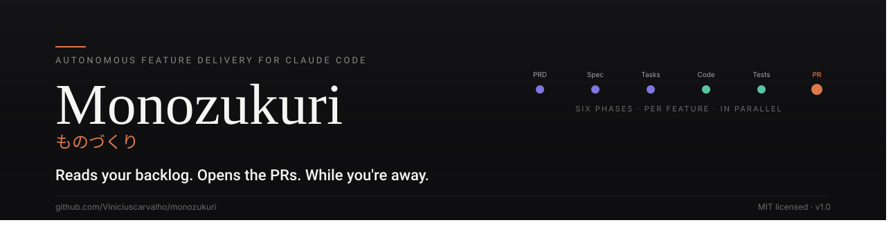
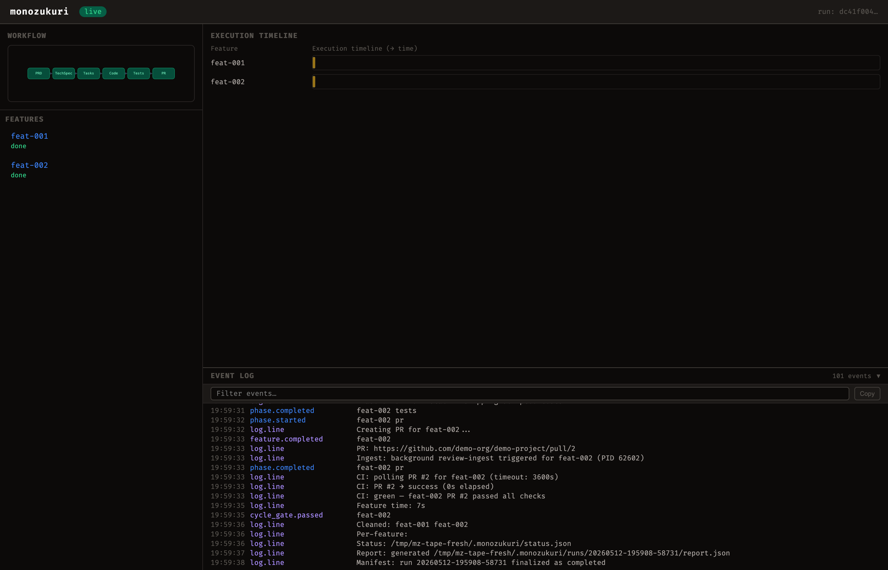

**ものづくり — reads your backlog, creates worktrees, runs a coding agent for each feature, and opens PRs. While you're away.**

[](https://www.npmjs.com/package/@viniciuscarvalho/monozukuri)
[](https://github.com/Viniciuscarvalho/homebrew-tap)
[](LICENSE)
[](https://github.com/Viniciuscarvalho/monozukuri)

> **Agent support:** Claude Code is the reference adapter — fully validated end-to-end. Codex, Gemini, and Kiro are experimental (rendered-prompt mode, no conformance recordings yet).

---




## Quick start

```bash
brew tap viniciuscarvalho/tap
brew install monozukuri

cd your-project
monozukuri init
monozukuri backlog list  # inspect ranked features
monozukuri backlog list --label cli,docs --agent codex
monozukuri backlog list --score-explain feat-001
monozukuri pick --top 3 --json | jq '.[].id'
monozukuri backlog validate feat-001 feat-002
monozukuri run --dry-run    # preview the plan
monozukuri run              # execute
monozukuri loop feat-001 feat-002 feat-003
```

> Requires `node >=18`, `jq`, `gh`, and a coding agent CLI (`claude`, `codex`, `gemini`, or `kiro`). See [docs/installation.md](docs/installation.md) for alternatives (NPX, from source) and platform notes.

## What Monozukuri does

For each feature in your backlog, Monozukuri creates an isolated git worktree, runs a coding agent to take the feature from PRD through tests, opens a pull request, and moves on. It supports **Claude Code, Codex, Gemini, and Kiro** — it defaults to [Feature-marker](https://github.com/Viniciuscarvalho/Feature-marker) on Claude Code but works with any agent you configure in `config.yaml`.

It runs in three autonomy levels — from `supervised` (Ink TUI, you approve each phase) to `full_auto` (structured logs, runs the whole backlog unattended). It persists state under `.monozukuri/` so you can `--resume` after any interruption, and it writes learnings to a three-tier store (feature / project / global) that primes future runs.

## Documentation

| Topic                                           | Where                                              |
| ----------------------------------------------- | -------------------------------------------------- |
| What execution looks like                       | [docs/execution.md](docs/execution.md)             |
| When something goes wrong                       | [docs/troubleshooting.md](docs/troubleshooting.md) |
| Autonomy levels in depth                        | [docs/autonomy.md](docs/autonomy.md)               |
| Configuration reference                         | [docs/configuration.md](docs/configuration.md)     |
| Backlog adapters (Linear / GitHub / Markdown)   | [docs/adapters.md](docs/adapters.md)               |
| Installation (NPX, from source, platform notes) | [docs/installation.md](docs/installation.md)       |
| Architecture decisions                          | [docs/adr/](docs/adr/)                             |

## Architecture decisions

| ADR                                                     | Decision                                                              |
| ------------------------------------------------------- | --------------------------------------------------------------------- |
| [ADR-008](docs/adr/008-orchestrator-economy.md)         | Token economy: cost gates, routing, 3-tier learning, size/cycle gates |
| [ADR-009](docs/adr/009-local-models.md)                 | Local model integration (Ollama embedding / classifier / summarizer)  |
| [ADR-010](docs/adr/010-stuck-state-elimination.md)      | Stuck-state elimination: subshell fix, timeouts, PID tracking         |
| [ADR-011](docs/adr/011-security-hardening.md)           | Security: prompt sanitization, permission guardrails, stack detection |
| [ADR-012](docs/adr/012-adapter-contract-and-schemas.md) | Adapter contract, schemas, and known incompatible skills              |

## The name

**Monozukuri** (ものづくり) is a Japanese concept meaning "the art and science of making things" — continuous improvement, craftsmanship, and the relentless pursuit of quality in creation. The same principles that should govern autonomous software delivery.

## License

MIT © [Vinicius Carvalho](https://github.com/Viniciuscarvalho)

Built with 🤖 for the AI-assisted development community.
